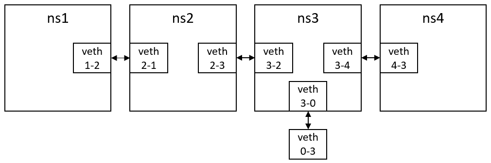
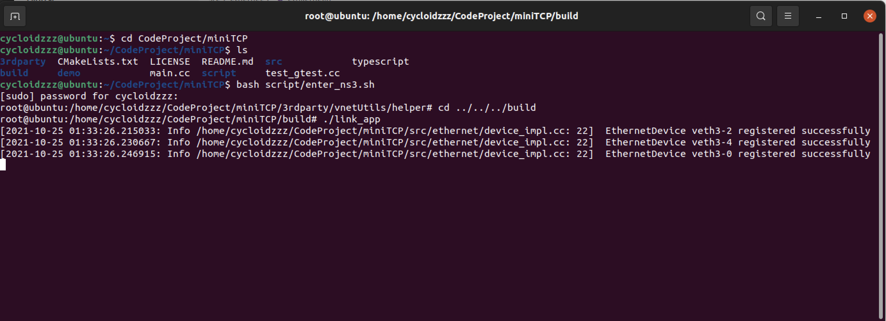
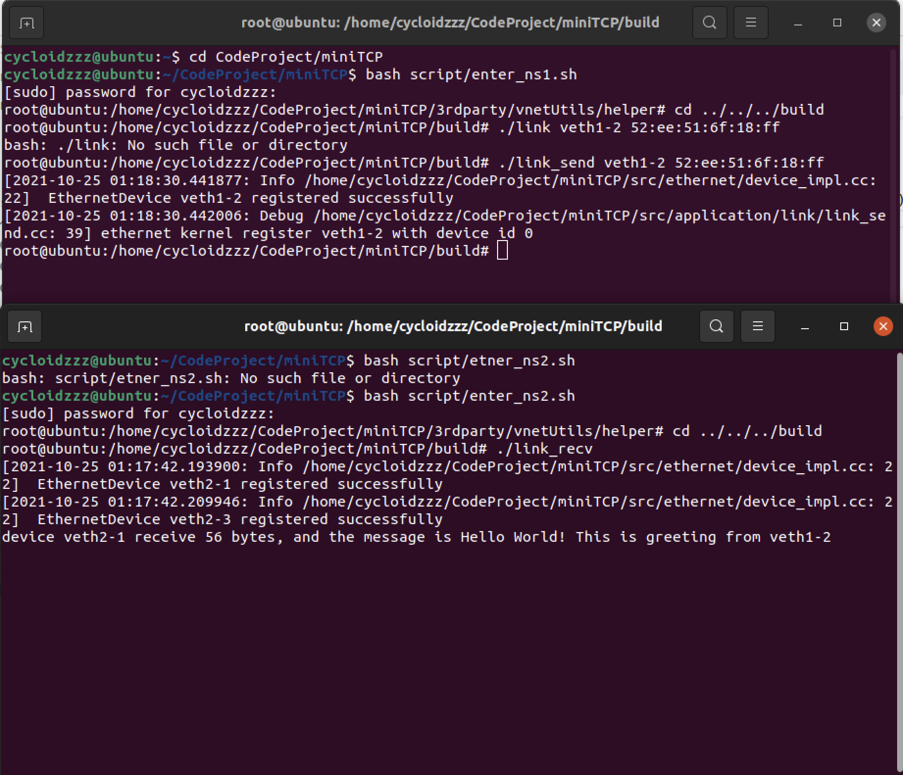

# miniTCP
A mini network protocol stack built upon libpcap.


### Usage

#### Part A

To install the demo program, please first enter the miniTCP directory and run the following command.

```shell
mkdir build
cd build
cmake ..
make
```

##### Note:

The network topology we use in checkpoint 1 and checkpoint 2 is exactly **the same as the example** given in the vnetUtils.




##### Checkpoint 1:  Show that your implementation can detect network interfaces on the host.

To run the demo, first use the following command to activate the NS environment.

```shell
bash script/install_ckpt1.sh
```


Run following command to enter ns#3.

```shell
bash script/enter_ns3.sh
```


To go back to the **build directory in miniTCP** after executing the bash script , please run the following command in the terminal.

```
cd ../../../build
```


To see the demo, please enter the build director in the root of miniTCP and run the following command.

```shell
./link_app
```


You can see the result of devices like this, which implies that the ethernet kernel successfully find all devices.




##### Checkpoint 2:  Show that your implementation can capture frames from a device and inject frames to a device using libpcap.

To run the demo, use the following command to activate the NS environment.

```shell
bash script/install_ckpt2.sh
```

Run following command to enter ns#1 in one terminal (namely, terminal#1).

```shell
bash script/enter_ns1.sh
```

Run following command on another terminal (namely, terminal#2) to enter ns#2.

```shell
bash script/etner_ns2.sh
```


To show that we can inject frames to a device as well as capture frames from a device, our demo is sending a greeting message from one terminal to another.


For example,  If you want to send a greeting message from veth 1-2 (in terminal#1) to veth 2-1 (in terminal#2).  


First start a listening application on terminal#2 by running

```shell
./link_recv
```


Suppose the mac address of destination (veth 2-1) is 52:ee:51:6f:18:ff, you can send the message by running on terminal#1.

```shell
./link_send veth1-2 52:ee:51:6f:18:ff
```


And the device veth 2-1 will receive this message and use a callback function to print out the message received.

The result of the checkpoint 2.


