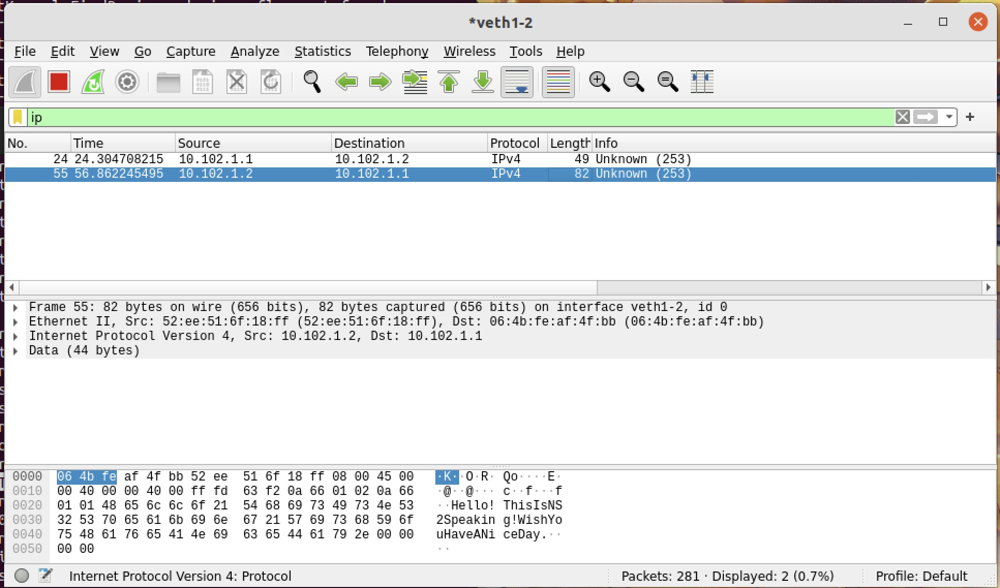
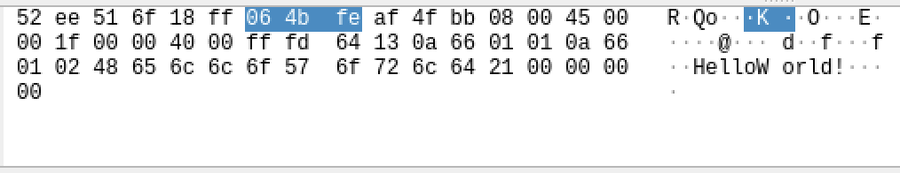
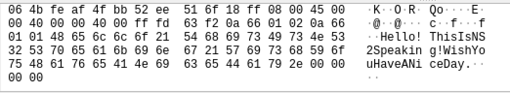
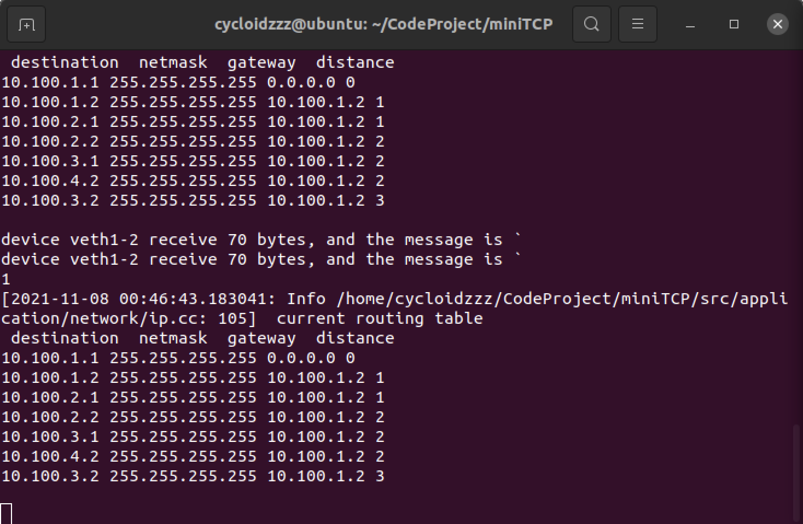
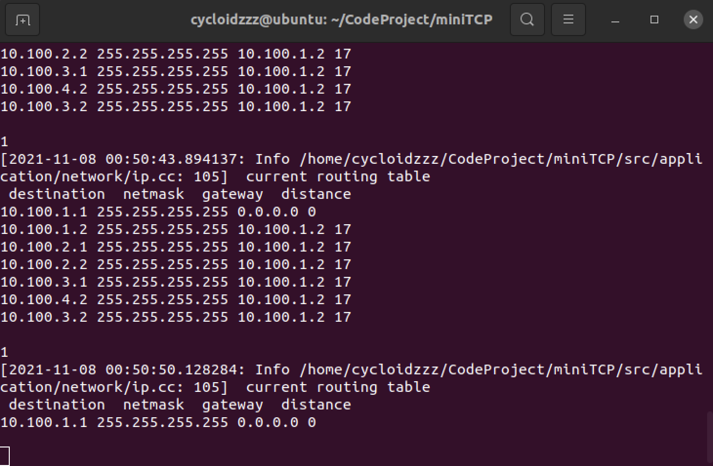
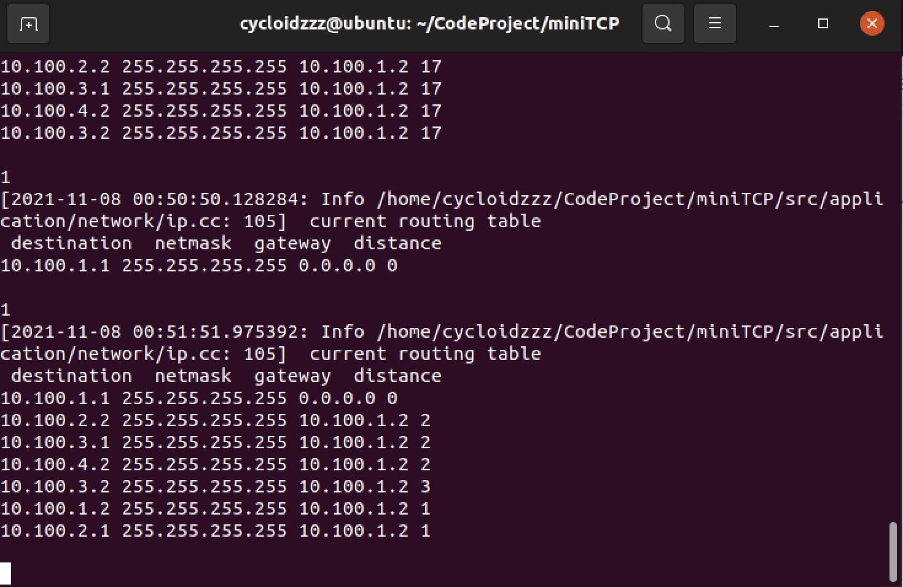
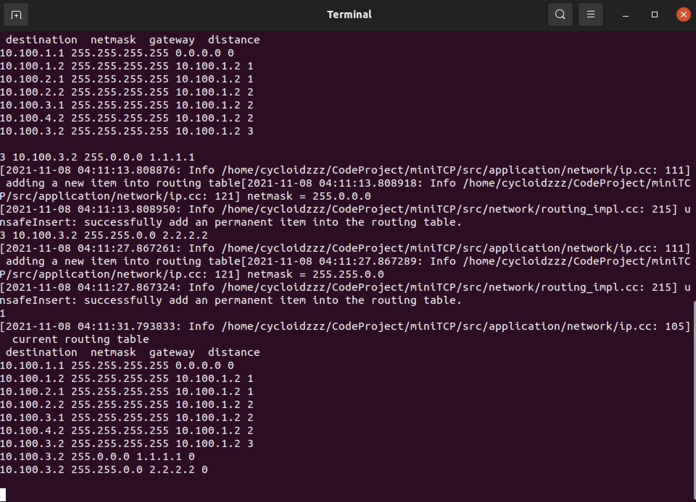
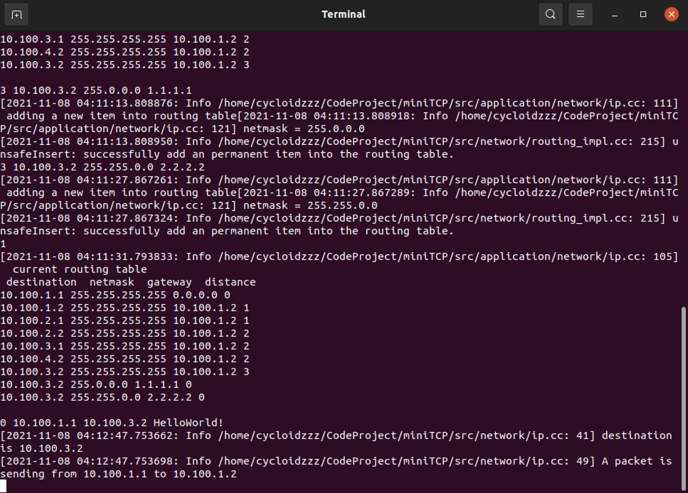
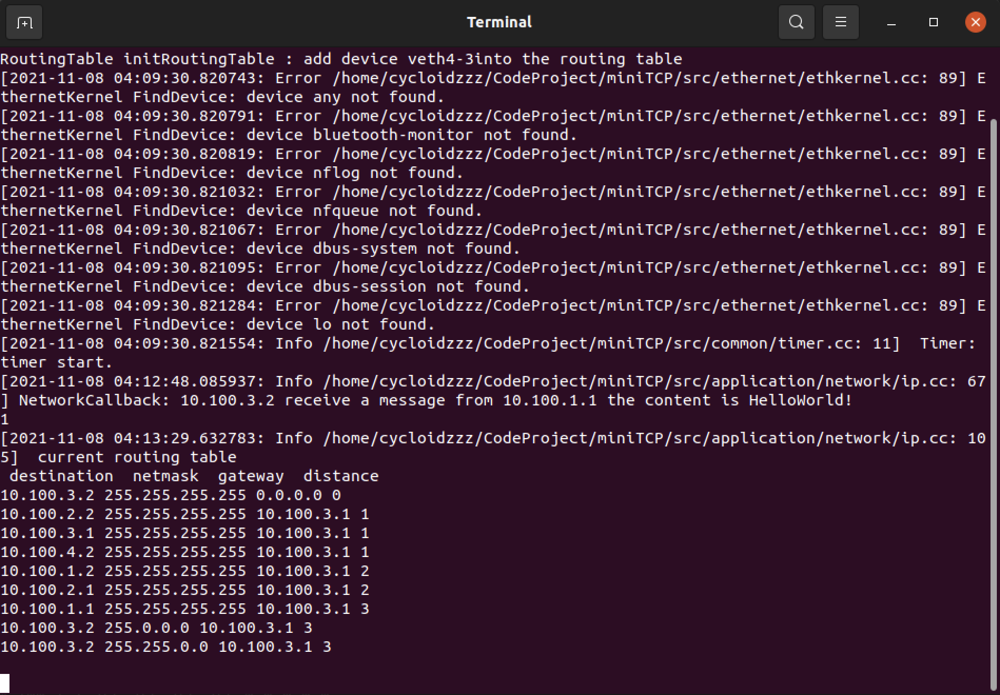

# miniTCP
A mini network protocol stack built upon libpcap.


## Usage

To make the program, please first enter the directory of miniTCP and execute the following commands.

```shell
mkdir build
cd build
sudo cmake ..
sudo make
cd ..
```


## Part A

##### Note:

The network topology we use in checkpoint 1 and checkpoint 2 is exactly **the same as the example** given in the vnetUtils.


#### Checkpoint 1:  Show that your implementation can detect network interfaces on the host.

To run the demo, first use the following command to activate the NS environment.

```shell
bash script/install_ckpt1.sh
```

Run following command to enter ns#3.

```shell
bash script/enter_ns3.sh
```


To go back to the **build directory in miniTCP** after executing the bash script , please run the following command in the terminal.

```
cd ../../../build
```

To see the demo, please enter the build director in the root of miniTCP and run the following command.

```shell
./link_app
```


You can see the result of devices like this, which implies that the ethernet kernel successfully find all devices.


#### Checkpoint 2:  Show that your implementation can capture frames from a device and inject frames to a device using libpcap.

To run the demo, use the following command to activate the NS environment.

```shell
bash script/install_ckpt2.sh
```

Run following command to enter ns#1 in one terminal (namely, terminal#1).

```shell
bash script/enter_ns1.sh
```

Run following command on another terminal (namely, terminal#2) to enter ns#2.

```shell
bash script/etner_ns2.sh
```


To show that we can inject frames to a device as well as capture frames from a device, our demo is sending a greeting message from one terminal to another.


For example,  If you want to send a greeting message from veth 1-2 (in terminal#1) to veth 2-1 (in terminal#2).  


First start a listening application on terminal#2 by running

```shell
./link_recv
```


Suppose the mac address of destination (veth 2-1) is 52:ee:51:6f:18:ff, you can send the message by running on terminal#1.

```shell
./link_send veth1-2 52:ee:51:6f:18:ff
```


And the device veth 2-1 will receive this message and use a callback function to print out the message received.

The result of the checkpoint 2.


## Part B

### Writing task1: Explain how you addressed this problem when implementing IP protocol.

​	I implement an arp protocol above the link layer [in the files ethernet/arp.h and ethernet/arp_impl.h]. If a device needs to find out the corresponding MAC address of an IP address when trying to send the IP datagram,  it can lookup the MAC address from the arp table.

​	To be more specific, the arp table on each host (terminals) is a singleton, the devices belong to this host would send out an ARP request as an announcement every 8 seconds. If a device receives an ARP request, it would first match whether the receiver IP matches its onw IP address, if it matches or the receiver IP is an broadcast IP, it would send back an ARP reply. An ARP entry will be removed from the ARP table if it is not updated within 48 seconds. 


### Writing task2: Describe your routing algorithm.

​	I implement RIP protocol above the link layer, which is a well-known distance vector algorithm.

   To be more specific, every host would maintain a local routing table, recording the destination, netmask of the destination, the corresponding nexthop ip and the metric (also known as the distance). We use the **hop number** from this host to the destination as the metric.

   A **timer will be maintained for each routing entry**. If a routing entry isn't updated by the host's neighbors within 18 seconds, the distance of the entry will be mark as inreachable  by setting it as 16 (the inreachable threshold) and the status of the entry will be marked as GARBAGE, a garbage collection will set set for this entry. If this entry is still not updated by the corresponding neighbor    within 12 seconds, this entry will be remove from the routing entry immediately. By using timeout, we can automatically adjust our routing table when the network condition changes.

  The hosts in the network will **send its own distance vector to its neighbors every 3 seconds**. The distance vector is an serialized object. It is consisted of the sender ip (4 bytes), number of entries (4 bytes) and multiple distance vector entries.

  A distance vector entry is defined as the following C struct. It mainly maintains the destination ip, the netmask and the distance from the sender host to the destination network.


```C
/* src/network/routing_impl.h */
#pragma pack(4)
struct DVEntry {
    ip_t dest;    
    ip_t netmask; 
    int distance;
};
#pragma pack()
```

  

​	When the host receives a distance vector from its neighbour, the host first deserielize the distance vector, figure out the sender ip (the nexthop ip), the number of entries that the distance vector contains and the content of the distance vector. Then the host updates its own routing table according to the information it receives.

  To accelerate the covergence of the algorithm, the **poison reversing** technique is also applied to the construction of the distance vector. Upon constructing the distance vector for a specific neighbor, we will mark the distance of the entries that learnt from this neighbor as inreachable.

  Since I haven't finish the transport layer yet, the only layer I can relay on to send the distance vector would be the **link layer**, which means the current algorithm is **sending/receiving raw ethernet frame**, which seems to be quiet strange. I will use a formal RIP protocol packet to construct my RIP protocol when UDP is built. 


### Checkpoint3

#### 1.Topology and IP Configuration

​	We use two NSs connected with each other in checkpoint3, namely ns1 and ns2.

​	The IP configuration of each ns is shown in the following table.


| NS   |                      |
| ---- | -------------------- |
| ns1  | veth1-2 (10.102.1.1) |
| ns2  | veth2-1 (10.102.1.2) |


#### 2.Usage

To check out checkpoint3, please execute the following command in the directory of miniTCP in the terminal.

```shell
python3 script/check3.py -install
```


In the same time, please run the following command on a new terminal to capture IP packet on ns1.

```
bash script/capture_ns.sh 1
```


After checking out the checkpoint3, please execute the following command to delete the configuration generated by vnetUtils.

```shell
python3 script/check3.py -delete
```


#### 3.Result

After several seconds, send a message from ns1 to ns2 by entering the following command in the terminal of ns1.

```
send 10.102.1.1 10.102.1.2 HelloWorld!
```


The terminal of ns1 will receive the message and print out the message.

Send a message from ns2 to ns1 by entering the following command in the terminal of ns2.


```
0 10.102.1.2 10.102.1.1 Hello!ThisIsNS2Speaking!WishYouHaveANiceDay.
```


Then we can capture 2 message by Wireshark.







To hexdump the first IP packet. The first 14 bytes are Ethernet II headers and we can omit them. 

The first byte of the packet is 0x45, and the most significant 4 bits of the first byte is 0x0100, it means it is using ipv4, the remaining 4 bits of the first byte is 0x0101, it means the length of the ip header is 5 * 4 = 20. 

The next byte of the packet header is 0x00.

The third and the fourth bytes consists of the total length of the ip packet.

The fifth and the sixth bytes are 0x0000, which consists of the ip identification of the packet.

The seventh and the eighth bytes are 0x4000, the seventh bytes is 0x40, which means this packet is not a fragmented ip packet.

The ninth byte is 0xff, which means the time to live of the packet.

The tenth byte is 0xfd, which means the protocol running on the ip is 253 (an arbitrary number I use to send IP packets).

The eleventh and the twelfth bytes are 0x6413, which is the checksum of the IP header.

The thirteenth to the sixteenth bytes are 0x0a660101, which means the source IP address is 10.102.1.1.

The seventeenth to the twentieth bytes are 0x0a660102, which means the destination IP address is 10.102.1.2.

The rest bytes are the message, which means "HelloWorld!"





To hexdump the first IP packet. The first 14 bytes are Ethernet II headers and we can omit them. 

The first byte of the packet is 0x45, and the most significant 4 bits of the first byte is 0x0100, it means it is using ipv4, the remaining 4 bits of the first byte is 0x0101, it means the length of the ip header is 5 * 4 = 20. 

The next byte of the packet header is 0x00.

The third and the fourth bytes are 0x0040, which consists of the total length of the ip packet.

The fifth and the sixth bytes are 0x0000, which consists of the ip identification of the packet.

The seventh and the eighth bytes are 0x4000, the seventh bytes is 0x40, which means this packet is not a fragmented ip packet.

The ninth byte is 0xff, which means the time to live of the packet.

The tenth byte is 0xfd, which means the protocol running on the ip is 253 (an arbitrary number I use to send IP packets).

The eleventh and the twelfth bytes are 0x63f2, which is the checksum of the IP header.

The thirteenth to the sixteenth bytes are 0x0a660102, which means the source IP address is 10.102.1.2.

The seventeenth to the twentieth bytes are 0x0a660101, which means the destination IP address is 10.102.1.1.

The rest bytes are the message, which means "Hello!ThisIsNS2Speaking!WishYouHaveANiceDay."


### Checkpoint4

#### 1. Topology and IP Configuration

The topology we use in this checkpoint is exactly the same as the example given in the vnetUils.


The IP address configuration is shown in the following table.

| NS   |                      |                      |                      |
| ---- | -------------------- | -------------------- | -------------------- |
| NS1  | veth1-2 (10.100.1.1) |                      |                      |
| NS2  | veth2-1 (10.100.1.2) | veth2-3 (10.100.2.1) |                      |
| NS3  | veth3-2 (10.100.2.2) | veth3-4 (10.100.3.1) | veth3-0 (10.100.4.2) |
| NS4  | veth4-3 (10.100.3.2) |                      |                      |


#### 2. Usage

To check out checkpoint4, please enter the miniTCP directory in the terminal and execute the following command

```shell
python3 script/check4.py -install
```

You may need to enter the password for several terminals to to get the sudo privilege.


After executing the command, you may need to wait for several seconds to wait for the convergence of the routing algorithm.


After checking out the checkpoint4, please execute the following command to delete the configuration generated by vnetUtils.

```shell
python3 script/check4.py -delete
```


#### 3. Result

(1) To show that NS1 finds NS4, enter 1 to let the terminal of NS1 to print out the routing table. We can find that the address 10.100.3.2 is in the routing table of NS1, which belongs to NS4.




(2) To show that NS1 cannot find NS4 after disconnecting NS2, directly terminate the corresponding terminal of NS2. After several seconds, enter 2 to show the routing table of NS1 again, we can find out that the IP address corresponding to NS2, NS3 and NS4 disappear.


The routing table of NS1 after removing NS2. The ip addresses belongs to NS2, NS3, NS4 are all marked as inreachable (distance equals 17) and being deleted in the next round.




(3) To show that NS1 can find NS4 again if NS2 reconnects to the network, please execute the following command in the directory of miniTCP in a new terminal.

```shell
bash script/enter_ns.sh 2
```


After several seconds, enter 2 in the terminal of NS1 to show the routing table, we can find out that the routing table of NS1 contains the IP addresses corresponding to NS2, NS3 and NS4 again.





### Checkpoint5

#### 1.Topology and IP Configuration

The IP address configuration is shown in the following table.


| NS   |                      |                      |                      |
| ---- | -------------------- | -------------------- | -------------------- |
| 1    | veth1-2 (10.101.1.1) |                      |                      |
| 2    | veth2-1 (10.101.1.2) | veth2-3 (10.101.2.1) | veth2-5 (10.101.4.1) |
| 3    | veth3-2 (10.101.2.2) | veth3-4 (10.101.3.1) | veth3-6 (10.101.6.1) |
| 4    | veth4-3 (10.101.3.2) |                      |                      |
| 5    | veth5-2 (10.101.4.2) |                      | veth5-6 (10.101.5.1) |
| 6    | veth6-3 (10.101.5.2) |                      | veth6-5 (10.101.6.2) |


#### 2.Usage

To check out checkpoint5, please execute the following command in the directory of miniTCP in the terminal.

```shell
python3 script/check5.py -install
```


After checking out the checkpoint5, please execute the following command to delete the configuration generated by vnetUtils.

```shell
python3 script/check5.py -delete
```


#### 3. Result

After several seconds, we can find out the distance from each NS to each IP address, which is shown in the following table.

| Source/destination | NS1  | NS2  | NS3  | NS4  | NS5  | NS6  |
| ------------------ | ---- | ---- | ---- | ---- | ---- | ---- |
| NS1                | 0    | 1    | 2    | 3    | 2    | 3    |
| NS2                | 1    | 0    | 1    | 2    | 1    | 2    |
| NS3                | 2    | 1    | 0    | 1    | 2    | 1    |
| NS4                | 3    | 2    | 1    | 0    | 3    | 2    |
| NS5                | 2    | 1    | 2    | 3    | 0    | 1    |
| NS6                | 3    | 2    | 1    | 2    | 1    | 0    |


To disconnect NS5, directly kill the terminal corresponding to NS5.

After several seconds, we can reprint the result of each terminal, the result is shown in the following table.


| Source/Destination | NS1  | NS2  | NS3  | NS4  | NS6  |
| ------------------ | ---- | ---- | ---- | ---- | ---- |
| NS1                | 0    | 1    | 2    | 3    | 3    |
| NS2                | 1    | 0    | 1    | 2    | 2    |
| NS3                | 2    | 1    | 0    | 1    | 1    |
| NS4                | 3    | 2    | 1    | 0    | 2    |
| NS6                | 3    | 2    | 1    | 2    | 0    |


### Checkpoint6

#### 1. Topology and IP Configuration

 We use the topology and the Ip configuration which are the same as the checkpoint4.

#### 2. Usage

To check out checkpoint6, please execute the following command in the directory of miniTCP in the terminal.

```shell
python3 script/check4.py -install
```


After checking out the checkpoint6, please execute the following command to delete the configuration generated by vnetUtils.

```shell
python3 script/check4.py -delete
```


#### 3. Result

We manully add two new routing entry into the routing table of NS1. By entering the following two lines into the terminal of NS1.

```
add 10.100.3.2 255.0.0.0 1.1.1.1
```

and

```
add 10.100.3.2 255.255.0.0 2.2.2.2
```





If the routing table fails to apply the longest prefix matching rule, then the device with IP address 10.100.3.2, which corresponds to NS4,  would not receive the message from NS1.


We send a message on NS1 by entering the following message on the terminal of NS1.

```
send 10.100.1.1 10.100.3.2 HelloWorld!
```





The only device (veth4-3) in NS4 can successfully receive the message from NS1as the following picture shows, which proves that our routing table faithfully follows the longest prefix matching rule.



